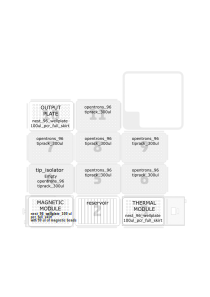

1-Description
=

This script is based on the protocol described in:

> Bramucci, A. R., Focardi, A., Rinke, C., Hugenholtz, P., Tyson, G. W., Seymour, J. R., & Raina, J.-B. (2021). Microvolume DNA extraction methods for microscale amplicon and metagenomic studies. ISME Communications, 1(1), 1–5.

## Important

> Lysis time: no more than 10 minutes  
> Stop buffer adding: no more than 5 minutes after heating  

**Tip isolator preparation**: preparar base de cajas de 20 (la base es igual a todas) con el portapuntas de 300. Sellarla, envolverla en papel albal y autoclavar. Al meterla en la estufa quitarle el papel albal para que se seque mejor. 

> IMPORTANT: use a tip rack with tips to calibrate tip isolator, and change it before starting the protocol (there is a pause)

### Before start

**Beads plate preparation**  

In order to avoid contamination due to the manipulation of the magnetic beads we are going to prepare the beads in a plate previously using the script "prepare_MagneticBeadsPlate_highVol.py".

**Buffer verification**  

1. Thaw buffers. 
2. Do a test to verify that the pH is correct   
    i. Mix a sample (360 ul) + DTT-Lysis-Buffer (270 ul)  
    ii. Add the Stop Buffer (270 ul)  
    iii. Test the pH, it should be ~8 (test with pH strips)  
3. Clean deck and prepare all required labware  
4. Prepare Vortex for microplate  
5. **Calibrate using a toy plate in magnetic module**  

Estimated running time: 1h:53m  

### Tiempos
5 minutos: pausa para sellar la placa y llevarla al -80. Si se va a continuar en el momento darle a resume run, llenará el tip isolator y calentará el bloque térmico. Mientras tanto, se sella la placa, se vortexea se centrifuga y se guarda en el -80 10 minutos.

19 minutos: Se pone la placa y se da a continuar. 4 minutos de espera. 

23,39: añade buffer de stop

30: añade bolitas

2-Settings
= 

**Api level**

To use a tip isolater version 2.9 is required.  
Higher api levels do not seem to work (at least version 2.11).  

**Pipettes**

Right\) p300_multi_gen2  

**Slots**

1\) [Magnetic module](https://opentrons.com/modules/magnetic-module/) loaded with a [nest_96_wellplate_100ul_pcr_full_skirt](https://labware.opentrons.com/nest_96_wellplate_100ul_pcr_full_skirt?category=wellPlate&manufacturer=NEST) with 90 ul of magnetic beads (Omega Bio-Tek Mag-Bind TotalPure NGS (SKU: M1378-00))  
2\) [nest_12_reservoir_15ml](https://labware.opentrons.com/nest_12_reservoir_15ml?category=reservoir)  

>A1) 4.5 ml of Lysis buffer

>A2) 4.5 ml of Stop buffer
 
>A4) 5 ml of Elution buffer (Tris-HCl 10mM EDTA 1mM) o solo Tris

>A5-A7) 11 ml sterile Water (for tip isolator)  

>A9-A12) 11 ml 70% Ethanol  

3\) [Temperature module](https://opentrons.com/modules/temperature-module/) + [nest_96_wellplate_100ul_pcr_full_skirt](https://labware.opentrons.com/nest_96_wellplate_100ul_pcr_full_skirt?category=wellPlate&manufacturer=NEST) with samples (centrifuge plate previously)  
4\) Tip isolator(Empty rack [opentrons_96_tiprack_300ul](https://labware.opentrons.com/opentrons_96_tiprack_300ul?category=tipRack&manufacturer=Opentrons))  
5, 6, 7, 8, 9 & 11\) [opentrons_96_tiprack_300ul](https://labware.opentrons.com/opentrons_96_tiprack_300ul?category=tipRack&manufacturer=Opentrons))  
10\) Output plate ([nest_96_wellplate_100ul_pcr_full_skirt](https://labware.opentrons.com/nest_96_wellplate_100ul_pcr_full_skirt?category=wellPlate&manufacturer=NEST))

3-Deck
= 

4-CHANGELOG
=

#### Notes for future changes...

### V3

Las magnetic beads ya no se ponen en el reservorio sino que hay que preparar una placa de PCR con la cantidad de beads por pocillo requeridas usando el protocolo "prepare_MagneticBeadsPlate_highVol.py". Esta placa se colocará sobre el módulo magnético. Las muestras, que se colocan en el módulo térmico inicialmente, tras la lisis y la neutralización se vuelven a colocan sobre el bloque térmico. Entonces, el robot transfiere las muestas del bloque térmico al magnético donde entrarán en contacto con las magnetic beads.

Por otro lado, durante la recuperación de DNA tras la elución se ha modificado el protocolo para que pipetee en varias alturas para recuperar el máximo volumen posible. 

Modicamos el paso 6: en lugar de incubar 5 minutos, mezclamos las muestras con las bolitas 2 veces (5 repeticiones de 150 ul).

### V2

Añadimos opción para elegir el número de columnas a procesar por el protocolo

### V1

#### Protocol

0. Put samples plate over temperature module
1. Add 27 ul of Lysis buffer to each sample (seal the plate, vortex, centrifuge and freeze)
2. Freeze plate at -80ºC for at least 10 minutes (up to 4 hours)
3. Heat samples at 55ºC for 4 minutes
4. Add 27 ul of Stop Buffer to the samples and mix (seal the plate, vortex, centrifuge and put in magnetic module)
5. Add 90 ul of magnetic beads (mix beads before, 10X-300ul) to the samples and mix (10X-150 ul). Drop tips in tip isolator to re-used then later. 
6. Incubate at RT for 5 minutes.
7. Engage magnet and incubate 5 minutes.
8. Remove supernatant (180 ul) using tips from tip isolator (drop tip in tip isolator)
9. Add 180 ul of 70% ethanol (using same tips for the whole plate) and incubate 1 minute ar RT
10. Remove supernatant (using tips from tip isolator and return them)
11. Repeat wash (steps 10 and 11)
12. Remove ethanol remains
13. Check if there are ethanol remains, remove manualy and let beads air dry for at least 10 minutes.
14. Disengage magnet, add elution buffer, mix  (20X-20 ul) and incubate for 5 minutes at RT
15. Engage magnet, wait for 5 minutes and transfer supernatant to output plate.

