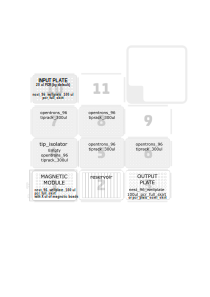

1-Description
=
PCR (or DNA) purification using magnetic beads (Omega Bio-Tek Mag-Bind TotalPure NGS (SKU: M1378-00)).

Estimated running time: 1h:37m (96 samples)  Pausa a 1h 14 min

**Tip isolator preparation**: rinse opentrons tips rack with 0.1 N HCl and wash 3 times with MQ water. Finally, autoclave the rack enveloped with aluminiun foil. 

> IMPORTANT: use a tip rack with tips to calibrate tip isolator, and change it before starting the protocol (there is a pause)  

> **IMPORTANTE**: Tras la calibración hay una pausa y el propio script calcula los volúmenes necesarios que hay que añadir en el reservorio. No añadir nada hasta que el robot te lo indique.  

> **BEADS**: Las beads se preparan en una placa de PCR con los scripts prepare_MagneticBeadsPlate_highVol.py o prepare_MagneticBeadsPlate_lowVol.py dependiendo del volumen necesario por pocillo, que dependerá del ratio de bolitas que se desee usar. Generalmente usamos un ratio de 0.85 y dado que el volumen de PCR que ponemos es 20, el volumen de bolitas debe ser 17 ul (PCR_volume * beads_ratio).   

> **QUITAR PUNTAS**: Si una columna de muestras no está completa se podría optar por quitar puntas (sólo las que van a pipetear las bolitas). El orden de las cajas de puntas es slot 5, 6, 7 y 8. Primero añade el agua al tip_isolator con una columna de puntas. Luego añade las bolitas. Si tenemos 3 columnas (la tercera incompleta), habrá que quitar las puntas de la 4ª columna del slot 5. Es decir, habrá que quitar las puntas de la columna + 1 (porque primero gasta 1 columna con el agua). Si la columna incompleta es la 12, habrá que quitar las puntas de la columna 1 del slot 6. **Verificar esto**

2-Settings
= 

**Api level**  

To use a tip isolater version 2.9 is required.  
Higher api levels do not seem to work (at least version 2.11).  

**Variables**  

Number of columns to process = 12  
PCR Volume = 20  
Total volume = 50 (SN to remove after binding to the beads)  
Ethanol washes = 2x150 ul  
Elution volume = 30 ul  

> To change these values go to the "Protocol variables" section of the script.  

**Pipettes**  

Right\) p300_multi_gen2  

**Slots**  

1\) [Magnetic module](https://opentrons.com/modules/magnetic-module/) with samples loaded into a [nest_96_wellplate_100ul_pcr_full_skirt](https://labware.opentrons.com/nest_96_wellplate_100ul_pcr_full_skirt?category=wellPlate&manufacturer=NEST))  
2\) [nest_12_reservoir_15ml](https://labware.opentrons.com/nest_12_reservoir_15ml?category=reservoir)  
	<!--
	A1\) Magnetic Beads (Omega Bio-Tek Mag-Bind TotalPure NGS (SKU: M1378-00))  
		> Bead volumen: PCR volume (20 ul) * beads ratio (1) * number of samples (number of columns * 8)  
		> Beads must be thoroughly shaken, vortexed and resuspended with the 10 ml pipettes to avoid clogs.  
		> Recover remaining beads at the end   
	-->
	<ul>
	A2\) Elution buffer or MQ water  
		> Elution volume: (20 ul) * number of samples  
	A4-A6\) 11 ml sterile Water (for tip isolator)  
	A9-A12\) 11 ml 70% Ethanol  
		> Ethanol volumen: (150 ul) * Number of washes (3) * number of samples, divided into several wells  
	</ul>
3\) Output plate ([nest_96_wellplate_100ul_pcr_full_skirt](https://labware.opentrons.com/nest_96_wellplate_100ul_pcr_full_skirt?category=wellPlate&manufacturer=NEST))  
4\) Tip isolator(Empty rack [opentrons_96_tiprack_300ul](https://labware.opentrons.com/opentrons_96_tiprack_300ul?category=tipRack&manufacturer=Opentrons))  
5, 6, 7 & 8\) [opentrons_96_tiprack_300ul](https://labware.opentrons.com/opentrons_96_tiprack_300ul?category=tipRack&manufacturer=Opentrons))  
10\) Input plate ([nest_96_wellplate_100ul_pcr_full_skirt](https://labware.opentrons.com/nest_96_wellplate_100ul_pcr_full_skirt?category=wellPlate&manufacturer=NEST) or [pcr_plate_semi_skirt](https://github.com/microenvgen/OT2/blob/426f8d04e7917903d9d31d308ecbcd8541383280/custom_labware/pcr_plate_semi_skirt.md)).  

3-Deck
= 

4-CHANGELOG
=

#### Notes for future changes...  

### V5

- Añado una variable para elegir el formato de placa de entrada (input): [nest_96_wellplate_100ul_pcr_full_skirt](https://labware.opentrons.com/nest_96_wellplate_100ul_pcr_full_skirt?category=wellPlate&manufacturer=NEST) \[Default\] o [pcr_plate_semi_skirt](https://github.com/microenvgen/OT2/blob/426f8d04e7917903d9d31d308ecbcd8541383280/custom_labware/pcr_plate_semi_skirt.md).  

> No puedo meterlo como parámetro en la app porque necesito usar la apiLevel=2.9 para que funcione el tip_isolator.  

### V4

Las magnetic beads ya no se ponen en el reservorio sino que hay que preparar una placa de PCR con la cantidad de beads por pocillo requeridas usando el protocolo "prepare_MagneticBeadsPlate_highVol.py" o "prepare_MagneticBeadsPlate_lowVol.py". Esta placa se colocará sobre el módulo magnético. La placa con las muestras (PCRs) se colocará en el slot 10. Entonces, el robot transfiere las muestas de la placa de entrada al magnético donde entrarán en contacto con las magnetic beads.

Modicamos el paso 2: en lugar de incubar 5 minutos, mezclamos las muestras con las bolitas 2 veces (5 repeticiones de 150 ul).

### V3

Durante la transferencia del eluido a la placa final hemos observado que goteo. Para evitarlo añadimos algunos cambios:
- Metemos un air_gap de 5 ul para que no gotee del iman a la placa de salida
- Añadimos un blow_out en la placa de salida
- Añadimos una agitación de la pipeta en la placa de salida para que caigan las gotas restantes

### V2  

Añado cálculo del número de cajas de puntas necesarias para no tener que ponerlas todas. 

### V1  

#### Protocol:  
1. Shake or vortex the Mag-Bind® Total Pure NGS to resuspend any particles (Mix in OT2)  
2. Add the desired volume of Mag-Bind® Total Pure NGS to each well based upon desired fragment size to recover  
3. Pipet up and down 5-10 times or vortex for 30 seconds.  
4. Let sit at room temperature for 5 minutes.  
5. Place the plate on a magnetic separation device to magnetize  
6. Aspirate and discard the cleared supernatant  
7. With the plate remaining on the magnet, add 200 μL 70% ethanol to each well  
8. Let sit at room temperature for 1 minute. It is not necessary to resuspend the Mag-Bind® Total Pure NGS.  
9. Aspirate and discard the cleared supernatant. Do not disturb the Mag-Bind® Total Pure NGS  
10. Repeat Steps 7-9 for a second 70% ethanol wash step  
11. Leave the plate on the magnetic separation device for 5-15 minutes to air dry the Mag-Bind® Total Pure NGS. Remove any residual liquid with a pipettor.  
12. Remove the plate from magnetic separation device  
13. Add 30-40 µL Elution Buffer (not provided) to each well.  
14. Pipet up and down 20 times or vortex for 30 seconds.  
15. Let sit at room temperature for 5 minutes.  
16. Place the plate on a magnetic separation device to magnetize  
17. Transfer the cleared supernatant containing purified DNA to a new 96-well microplate and seal with non-permeable sealing film  

