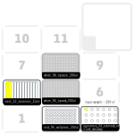

1-Description
=

Perfoms serial dilution of a microbial sample to determine the appropiate dilution to isolate bacterial clones by limiting dilution.  

2-Settings
= 

### Pipettes

Left\) p300_single_gen2  
Right\) p300_multi_gen2  

### Slots

4): [nest_12_reservoir_15ml](https://labware.opentrons.com/nest_12_reservoir_15ml?category=reservoir)  
2): [nest_96_wellplate_200ul_flat](https://labware.opentrons.com/nest_96_wellplate_200ul_flat?category=wellPlate)  
3): Input Sample (1.5 ml screwcap tube with 200 ul) in position A1 into [opentrons_24_tuberack_nest_1.5ml_screwcap](https://labware.opentrons.com/opentrons_24_tuberack_nest_1.5ml_screwcap?category=tubeRack)  
8): [white_96_tiprack_200ul.md](https://github.com/microenvgen/OT2/blob/2e3f56d2ce81524a89d889d5d0c819ec240274b0/custom_labwares/white_96_tiprack_200ul.md) for single channel pipette  
5): [white_96_tiprack_200ul.md](https://github.com/microenvgen/OT2/blob/2e3f56d2ce81524a89d889d5d0c819ec240274b0/custom_labwares/white_96_tiprack_200ul.md) for multi channel pipette  

3-Deck
= 

4-CHANGELOG
=

### Notes for future changes...

### V1

Step by Step description:

1. Add 180 μL of R2A medium to each well. Using the multi-channel pipette. 8 tips are used but not discarded.  
2. Add 20 μL of sample to the wells in the first column. Only one tip is used by the single-channel pipette.  
3. Perform serial dilutions with the multi-channel pipette. Mix in previous column and transfer 20 ul to the next column. The last column is left blank as a negative control.  
4. END. Close plate with lid and grow at 28 ºC for 48-72 hours.  

### Alternative labwares/steps

1. We used a custom tip rack ("white_96_tiprack_200ul") by using a [BioRad](https://www.bio-rad.com/es-es/sku/2239303-standard-pipet-tips-mtp-35-1-200-ul?ID=2239303) tip rack filled with [Shappire 200 ul tips](https://shop.gbo.com/es/spain/products/bioscience/manipulacion-de-liquidos/puntas-de-pipetas-old/pipette-tips-bulk/775350.html?_ga=2.13874871.1877740134.1714050421-2136557820.1714050421). To fit the tip rack to the OT2 we used a [3D printed adapter](https://github.com/microenvgen/OT2/blob/ad6bb537fa518afc48c8bad27223f29afaed6ada/custom_labware/white_96_tiprack_200ul.stl). These tips racks can be easily change in the script code by modifying _tips_brand_ variable.  
