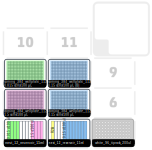

1-Description
=

Fill four 384-well plates to obtain concentrations of 0.015, 2x0.15 and 1.5 cells/100 μL using calculations performed with "c2_Dilution_Calculator.R".  

2-Settings
= 

### Pipettes

Right\) p300_multi_gen2  

### Slots

1): Reservoir 1 - [nest_12_reservoir_15ml](https://labware.opentrons.com/nest_12_reservoir_15ml?category=reservoir)  

> Wells A1-A4: 11 ml of sample at 0.015 cell/100 ul in each well.  
> Wells A8-A12: 11 ml of sample at 1.5 cell/100 ul in each well.  

2): Reservoir 2 - [nest_12_reservoir_15ml](https://labware.opentrons.com/nest_12_reservoir_15ml?category=reservoir)  

> Well A1: 11 ml of medium to be used as negative control.  
> Wells A4-A12: 11 ml of sample at 0.15 cell/100 ul in each well.  

3): [white_96_tiprack_200ul.md](https://github.com/microenvgen/OT2/blob/2e3f56d2ce81524a89d889d5d0c819ec240274b0/custom_labwares/white_96_tiprack_200ul.md)  
7): Plate to be filled with 0.015 cell/well[corning_384_wellplate_112ul_flat](https://labware.opentrons.com/corning_384_wellplate_112ul_flat?category=wellPlate)  
4): Plate to be filled with 1.5 cell/well[corning_384_wellplate_112ul_flat](https://labware.opentrons.com/corning_384_wellplate_112ul_flat?category=wellPlate)  
5): Plate to be filled with 0.15 cell/well[corning_384_wellplate_112ul_flat](https://labware.opentrons.com/corning_384_wellplate_112ul_flat?category=wellPlate)  
8): Second plate to be filled with 0.15 cell/well[corning_384_wellplate_112ul_flat](https://labware.opentrons.com/corning_384_wellplate_112ul_flat?category=wellPlate)  Esta será la que llamaremos 0,15* y despues intermediaasterisco

3-Deck
= 

4-CHANGELOG
=

### Notes for future changes...

### V1

Step by Step description:

1. Fill a 384-well plate with sample diluted to 0.015 cells/100 μL. Each one of the reservoir compartments (10 ml) will be used to fill 6 columns, except the last one which will fill 5 columns and a half.  
2. Fill a 384-well plate with sample diluted to 0.15 cells/100 μL. Each one of the reservoir compartments (10 ml) will be used to fill 6 columns, except the last one which will fill 5 columns and a half. In case we have two of these plates, this will be done for both.  
3. Fill the second 384-well plate with sample diluted to 0.15 cells/100 μL. Each one of the reservoir compartments (10 ml) will be used to fill 6 columns, except the last one which will fill 5 columns and a half. In case we have two of these plates, this will be done for both.  
4. Fill a 384-well plate with sample diluted to 1.5 cells/100 μL. Each one of the reservoir compartments (10 ml) will be used to fill 6 columns, except the last one which will fill 5 columns and a half.  
5. Include the negative controls in all plates.  
6. END. Close plate with lid and grow at 28 ºC for 48-72 hours.  

### Alternative labwares/steps

1. We used a custom tip rack ("white_96_tiprack_200ul") by using a [BioRad](https://www.bio-rad.com/es-es/sku/2239303-standard-pipet-tips-mtp-35-1-200-ul?ID=2239303) tip rack filled with [Shappire 200 ul tips](https://shop.gbo.com/es/spain/products/bioscience/manipulacion-de-liquidos/puntas-de-pipetas-old/pipette-tips-bulk/775350.html?_ga=2.13874871.1877740134.1714050421-2136557820.1714050421). To fit the tip rack to the OT2 we used a [3D printed adapter](https://github.com/microenvgen/OT2/blob/ad6bb537fa518afc48c8bad27223f29afaed6ada/custom_labware/white_96_tiprack_200ul.stl). These tips racks can be easily change in the script code by modifying _tips_brand_ variable.  
