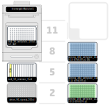

 1-Description
=

In this step we transfer selected wells from 384 plates (based on the calculations by [c4_Plate_Evaluation.R](./c4_Plate_Evaluation.R)) to a 96 wells plate for DNA extraction and to PCR strip tubes to prepare glycerol stocks. Due to some lack of precision when using simultaneously single and multichannel pipettes (because calibration is only performed with single channel), we have divided this steps into 2 scripts:

- Part 1 (c5_Well_Selection_part_1.py): reads file generate with [c4_Plate_Evaluation.R](./c4_Plate_Evaluation.R) and transfer 35 ul from 384 plates selected wells (max=93 wells) to a 96 wells plate onto the ThermoCycler module. 

The script searches for the requires files ((wells_0015 and/or wells_015 and/or wells_015b) in the robot folder (/data/user_storage/), so, before running this script the files should be copied to the robot:


> Before copying the new files to the robot we must delete the old ones:

```DOS
ssh -i C:\Users\meg_ot2\Documents\GitHub\OT2\Claves\ot2_A204_ssh_key root@169.254.53.144
cd /data/user_storage/
rm -fr well_*
```

> We now copy the data as follows:

```DOS
scp -i C:\Users\meg_ot2\Documents\GitHub\OT2\Claves\ot2_A204_ssh_key C:\Users\meg_ot2\Desktop\Placas_OT2\wells_* root@169.254.53.144:\data\user_storage\
```

> As [c4_Plate_Evaluation.R](./c4_Plate_Evaluation.R) script could create, 1, 2 o 3 files, depending on the positive wells obtained, this script reads the files, checks the total number of selected wells (<=93) and remove the files to avoid problems in future executions (by reading old versions). Accordingly to the number of files found the number of 384w plates to load (and the positions) is going to change and this is warmed. 

- Part 2 (c5_Well_Selection_part_2.py): this script prepares glycerol stocks and perform DNA extraction using a the method described in Zhang's paper (Zhang, J., Liu, Y.-X., Guo, X., Qin, Y., Garrido-Oter, R., Schulze-Lefert, P., & Bai, Y. (2021). High-throughput cultivation and identification of bacteria from the plant root microbiota. Nature Protocols.)


2-Settings
= 

### Pipettes

**Part 1 labware**

_Pipette_: p300_single_gen2 (left)  


7-8-10-11): [thermocyclerModuleV2](https://opentrons.com/products/modules/thermocycler/)  

4): Reservoir [nest_12_reservoir_15ml](https://labware.opentrons.com/nest_12_reservoir_15ml?category=reservoir)  

> Well A1: 2 ml of medium to be used as negative control. 

1): [white_96_tiprack_200ul.md](https://github.com/microenvgen/OT2/blob/2e3f56d2ce81524a89d889d5d0c819ec240274b0/custom_labwares/white_96_tiprack_200ul.md)  

_Plates (depending on the number of input files)_  
3): Plate seeded with 0.015 cell/well [corning_384_wellplate_112ul_flat](https://labware.opentrons.com/corning_384_wellplate_112ul_flat?category=wellPlate)  
6): Plate seeded with 0.15 cell/well [corning_384_wellplate_112ul_flat](https://labware.opentrons.com/corning_384_wellplate_112ul_flat?category=wellPlate)  
9): Second plate (b) seeded with 0.15 cell/well [corning_384_wellplate_112ul_flat](https://labware.opentrons.com/corning_384_wellplate_112ul_flat?category=wellPlate)  

**Part 2 labware**

_Remove 384w plates, put 2 new tip racks and add required buffers to reservoir._

_Pipette_: p300_multi_gen2 (right)  


7-8-10-11) [thermocyclerModuleV2](https://opentrons.com/products/modules/thermocycler/)  

4): Reservoir [nest_12_reservoir_15ml](https://labware.opentrons.com/nest_12_reservoir_15ml?category=reservoir)  

> Well A1: 2 ml of medium to be used as negative control (from previous part).  
> Well A3: 5 ml of esterile 80% glycerol (25 ul / well * 96 wells -> 2.4 ml + reservoir death volume)  
> Well A5: 5 ml of Alkaline lysis buffer (25 mM NaOH, 0.2 mM Na<sub>2</sub>EDTA)  
> Well A7: 5 ml of Neutralization buffer (40 mM Tris-HCl, ph 7.5)  

1-2): [white_96_tiprack_200ul.md](https://github.com/microenvgen/OT2/blob/2e3f56d2ce81524a89d889d5d0c819ec240274b0/custom_labwares/white_96_tiprack_200ul.md)  

5:) [pcr_strip_rack](https://github.com/microenvgen/OT2/blob/2e3f56d2ce81524a89d889d5d0c819ec240274b0/custom_labwares/pcr_strip_rack.md)  


3-Deck
= 

**Part 1**



**Part 2**


4-Times
=
first part

-41 minutes ends

second part

-7 minutes: finish adding glycerol

-23 minutes: finish adding samples to glycerols. change tips

-34 minutes: finish adding lysis buffer. pause for sticker and tips.
1h 9 minutes pause to remove sticker, if you remove it right away be careful it burns

1h19 minutes: ends

5-CHANGELOG
=

### Notes for future changes...


### V2

- Updating script to apiLevel 2.20 to use runtime input files. 


### V1  

Step by Step description:

**Part 1**  

1. Transfer 35 ul from the selected wells to the PCR plate over ThermoCycler
2. Add 35 ul of medium to F12 well as negative control

**Part 2**  

3. Add 25 ul of 80% glycerol to PCR strips
4. Transfer 25 ul of each sample from PCR plate to glycerol and mix
5. PAUSE: Close, mark and store glycerols at -80ºC. Refill tips (empty trash)
6. Add 20 ul of lysis buffer to each well in the PCR plate and mix
7. Close PCR plate with aluminum seal
8. Heat samples 30 minutes to 95ºC
9. Let cool to 20ºC
10. PAUSE: remove PCR seal carefully
11. Add 20 ul of neutralizatoin buffer to each well in the PCR plate and mix
12. END: Close PCR plate with a new aluminum seal and store at -20ºC.


### Alternative labwares/steps

1. We used a custom tip rack ("white_96_tiprack_200ul") by using a [BioRad](https://www.bio-rad.com/es-es/sku/2239303-standard-pipet-tips-mtp-35-1-200-ul?ID=2239303) tip rack filled with [Shappire 200 ul tips](https://shop.gbo.com/es/spain/products/bioscience/manipulacion-de-liquidos/puntas-de-pipetas-old/pipette-tips-bulk/775350.html?_ga=2.13874871.1877740134.1714050421-2136557820.1714050421). To fit the tip rack to the OT2 we used a [3D printed adapter](./custom_labware/white_96_tiprack_200ul.stl). These tips racks can be easily change in the script code by modifying _tips_brand_ variable.  
2. We used Opentrons ThermaCycler Module V2, but this can also be performed with V1, just replace module name in the load module line.  
3. We used [pcr_strip_rack](https://github.com/microenvgen/OT2/blob/2e3f56d2ce81524a89d889d5d0c819ec240274b0/custom_labwares/pcr_strip_rack.md) that is 3D printed PCR tube strips adapter/rack base on [Opentrons 96 Well Aluminum Block with Generic PCR Strip 200 µL](https://labware.opentrons.com/opentrons_96_aluminumblock_generic_pcr_strip_200ul?category=aluminumBlock). We used PCR strip from Axygen (REF: PCR-0208-FCP-C). Original Opentrons 96 Well Aluminum Block can also be used.  
